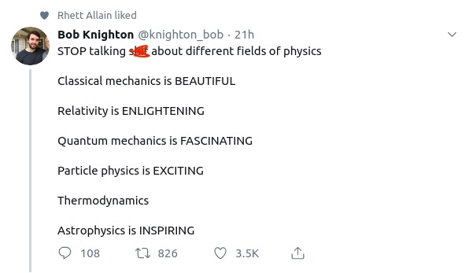

# Fall 2026 - Thermal Physics - Daily Log

## Notes:

[Chapter 1](<https://github.com/ehremington/ph420-2026-fall/raw/main/chapter1.pdf>)

## Homework: 

[Schroeder chapter 1 to get you started on hw.](<https://samford.instructure.com/courses/59847/files/6557959?wrap=1> "schroeder-chapter1.pdf")

| Homework Due | Assignment | Submission |
| --- | --- | --- |
| 260826 W | \# 1.1, and question from notes | [260826](<https://samford.instructure.com/courses/59847/assignments/691796> "260826") |
| 260828 F| week 1 worksheet | week 1 |
| 260831 M

## day 2

We are going to review some basics from Thermodynamics and add to them as we go through the next several classes. For today, we will review through "week 1" of PHYS102 by doing a worksheet from that class as a way to get started in this. Over the next few days we will do "week 2" and "week 3", and then we will begin to add some things onto this basic understanding. 

## day 1

[Link to our book](https://physics.weber.edu/thermal/default.html)

## day 0

We will meet in room 011 of Propst Hall. Sorry about the confusion of this. 

Check out the syllabus!

Check out this website: https://manytinythings.github.io/

    [NbConvertApp] Converting notebook README.ipynb to markdown
    [NbConvertApp] Support files will be in README_files/
    [NbConvertApp] Writing 1427 bytes to README.md

