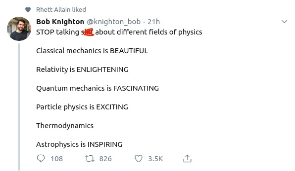

# Fall 2026 - Thermal Physics - Daily Log

## Notes:

[Chapter 1](<https://github.com/ehremington/ph420-2026-fall/raw/main/chapter1.pdf>)

## Homework: 

[Schroeder chapter 1 to get you started on hw.](<https://samford.instructure.com/courses/59847/files/6557959?wrap=1> "schroeder-chapter1.pdf")

| Homework Due | Assignment |
| --- | --- | 
| 260826 W | \# 1.1, and question from notes | 
| 260828 F | week 1 worksheet | 
| 260831 M | week 2 worksheet | 
| 260902 W | week 3 worksheet | 
| 260928 M | 2.6, 8, 10 | 
| 261007 W | 2.18, 22, 29, 30 | 

## day 19 | 261007 W

Today we will begin another very large argument, looking at the multiplicity of an ideal gas, and working forward to look at the entropy of an ideal gas. This is a very large task in the way we have understood multiplicity as the number of ways of arranging the energy in a material. So far we have only dealt with Einstein solids, the atoms of which don't move around. Now we have a gas, where not only do the atoms move around, but also have different levels of energy. So, we need to spend a little bit of time understanding some very basic quantum mechanics, and we also need to understand that this way of doing things, although a bit contrived feeling, has a lot of good machinery in it for us to learn from. 

## day 18 | 261005 M

We will look at the Einstein solid and evalutate what the temperature of it would be, at least in the high temperature regime. That is, we will start with the multiplicity, we will use that to find the entropy and we will use that to find the temperature. And we should see some interesting things result from that. First of all, our previous discussion of the energy of a material depending on the degrees of freedom of that material should come back and make some sense. What we will see is that a 1D Einstein solid has 2 degrees of freedom, and that works out nicely in our derivation. Second, we will begin discussing the *Heat Capacity* which is a concept that we skipped over a bit from Chapter 1, but we will see how we can make a prediction about the heat capacity and talk about how we might design an experiment to test this. 

## day 17 | 261002 F

Today we will finally have a proper definition of temperature. So far, we have gotten by with the temperature being the value that a thermometer tells you, but that has not been a very satisfying definition. Perhaps the definition after today's lecture won't leave you with the warm and fuzzies, but at least we will have something we can use and think about. And we will put this into practice next time with the Einstein solid and see what we can learn from that.

## day 16 | 260930 W

We will introduce a new concept today that has a confusing name, but which is both foundational to the study of thermal physics and also a little bit of a let down. **The Entropy** of a material is ready for it, nothing other than the.... natural log of multiplicity\\(_{\text{times a Boltzmann constant}}\\). Hmmm. Let's break that down a little bit. The multiplicity was just the number of microstates in one particular macrostate. We reasoned that materials would most often be measured in the macrostate that had the most microstates, and that just because of the enormous numbers that we are dealing with that this will always result in the material being found in only a narrow range of macrostates. So taking the natural log here and then multiplying by a constant and calling that a new thing with a fancy name like *entropy* feels a little suspicious. And yes the entropy can be used in other ways as we will see, but it is nothing more that this. Just a slightly easier way to count the number of microstates by taking the natural log. 

## day 15 | 260928 M

We will look at how to handle large numbers as well as how to handle **very** large numbers. And we will introduce *Stirling's approximation* which will give us a way of calculating these enormous numbers and give us some ways of simplifying things. One other way we can reduce the size of these things is to use logarithms, and that is exactly what we will do. So we will get an expression for the natural log of the multiplicity and we will investigate this in the *high temperature limit* and that is when we have many more energy packets \\(q\\) than we have numbers of particles \\(N\\).

## day 14 | 260925 F

Today we largely will look at what we did yesterday, except we will get our computers to crunch the numbers for us. So we will look at a simple case first of two Einstein solids with 3 particles each, and we will count the number of microstates again using the multiplicity formula. We can then ask about larger numbers of particles that would be very cumbersome to calculate by hand. One thing that we will see however, is that this quickly becomes too cumbersome for even our computers to handle! These numbers are astronomically large, so that will pose some challenges that we will discuss next time.

## day 13 | 260923 W

Today we will begin chapter 2. We will start something called the multiplicity, which is simply a way to count the number of *microstates* in a *macrostate*. A *microstate* is one particular arrangement or combination of something (like coin flips, or dices rolls, or energy packets in an atom). Energy can be arranged in a dizzying number of microstates, while all being in the same *macrostate*, which is usually a measureable thing, like the total amount of energy in the solid. by saying that the particular energy packets can wander around and be in any particular atom randomly and can transfer quickly, we are forming a model about how the energy in that solid works. But what we measure about the substance is not the energy in any one particular atom, but rather the total number of energy packets distributed around the solid. So we measure a macrostate, like how much energy is there, or how many particles are there. 

## day 12 | 260921 M

Today, we will continue down the path of problem 1.17, finishing up what we hoped to get done last time, and working again, this time on part (c) and (d). These again are involving skills that I hope you get good at, and we will discuss alternate ways of doing them, but at the end of the day, the second order expansion is an important tool, and just the idea of plotting something and figuring out how to fit something else to it are important. And yes! I am leaving those 'somethings' vague here intentionally, because like last time, I want you to think about the meta-goal here, not the actual problem at hand. But of course we have to work on something specific to give an example of doing that. 

## day 11 | 260918 F

Today we started a very involved problem, 1.17. This problem is so tough because it involves some deep problem solving techniques that I think are worth showing to the entire class. So pay attention to the problem, but pay attention to the meta-problem of how to solve it and what processes are involved. We focus today just on part (a), which involves solving a quadratic equation, which on the face of it is not that bad, but again, there are issues of which of the two values that come out of the quadratic equation are the correct one? We will use the Ideal Gas Law, not the virial expansion to help us decide.

[Include a link to jupyter file.](assignments/1p17-in-class.ipynb)

## day 10 | 260916 W

We will finish the problem 1.16 that we started last time. There are some important notes from this I want you to have. Separation of Variables is an extremely useful technique for solving many differential equations in physics. 

## day 9 | 260914 M

We will begin today going through in class some above average questions from chapter 1, which do not belong within the broader text, but which are still important, either because they are using some element of reasoning that we will use again, or they have some math technique in them that is good to see. 

## day 8 | 260911 F

We will talk through the last few bits of intoductory thermo, by discussing the isothermal process along with the adiabatic process. I want to leave some notes here as a summary of our discussion today on these processes.

An *isothermal process* is one where the temperature is constant. This amounts in most situations to no change in internal energy, so we can summarize it like this

\\[\Delta U = 0 = Q + W\\]
\\[Q=-W\\]

Now this is fine to say, but it leaves a question about how to we find the work? The pressure changes as the volume changes, so this means that there is an integral to do. The answer is that 

\\[W = -N k_B T \ln\frac{V\_2}{V\_1}\\]

and since in the heat is the opposite of work in this case:

\\[Q = N k_B T \ln\frac{V\_2}{V\_1}\\]

Just be careful about some books absorbing that negative sign in the work formula and inverting the Volume ratio without telling you.

An *adiabatic process* is one in which no heat is added or removed during the change in volume. There are two ways of looking at this:

1. According to the first law in the way that we have used it

\\[\Delta U = \cancelto{0}{Q} + W\\]

The consequence of this is that 

\\[\Delta U = \frac{f}{2}N k\_B T = W \\]

2. Also according to the first law, but in a smaller sense we have

\\[dU = \bar{d} W\\]

From this expression, we can derive the following formula:

$$\left(\frac{T\_2}{T\_1}\right)^{f/2} = \frac{V\_1}{V\_2}$$

And combined with the ideal gas law, we can work through many different situations.

## day 7 | 260909 W

We will continue to work on the week 3 worksheet and finish up thermodynamic cycles by talking through different kinds of cycles and through the end of this worksheet.

## 260907 M - Labor Day

## day 6 | 260904 F

We begin right in the middle of a problem, but there are some important things within this problem that I did not want to rush through. Some of these things we will see and offer proofs of throughout this semester. One of the most important of these is the equipartition theorem, which is jumping a head slightly, but I'll go ahead and introduce it now and we will cover it again soon. The equipartition theorem says that for each degree of freedom (that is each way or direction that a particle can have energy) each add \\(1/2 kT\\). This means that for N particles within a substance the total energy of that substance can be found with:

\\[U\_{int} = N f \frac{1}{2} k_B T\\]

Thus for an ideal, monatomic gas, which can only move in three dimensions and can not spin in a way that we can measure would have \\(f=3\\). For a diatomic gas, which can move in three dimension and can spin in a couple of ways that are distinquishable, then in that case \\(f = 5\\). 

This is something that we will use repeatedly with the first law of Thermo, so it will be very useful to see it in action here. 

With this in place, we continue to go through the worksheets, keeping in mind what our questions are and the things that we need to revisit. As far as our content goes, these worksheets have served as a quick introduction, and a fast paced sweep through sections 1-6 of chapter 1. But we need to make sure that we are covering things carefully as we begin, so next week we will go through some extra pieces in chapter 1 and hopefully clean up some misunderstandings that we have so far.

## day 5 | 260902 W

Today we will begin to add *work* in with the heat as the two ways to change the internal energy of a gas. We talked through the usefulness of a PV diagram to keep track of how the state of a gas changes over some type of transformation. There are infinitely many transformations, but we will stick with a few that help us categorize and learn more about all of these quantities. In particular, we ended talking about the isobaric transformation and we will pick up next time talking through how heat is given off or absorbed during an isobaric transformation.

## day 4 | 260831 M

We continued through week 2 worksheet. Week 2 is focussed on heat and how heat can be applied to both a solid, liquid and gas. We typically treat solids and liquids together with the *specific heat* equation, and treat gases separately with the heat capacity at constant volume or pressure. This shows that there is a little bit more going on with gases and this is something that we are going to cover much more of in the future. 

## day 3 | 260828 F

We kept going through the worksheets and worked through more of the week 1 worksheet. This worksheet focusses on the ideal gas law and the parameters that we think of when we are talking about a gas. These *state variable* work together through a *state equation*. One kind of state equation is the ideal gas law, but there are others as well that we will encounter soon. 

## day 2 | 260826 W

We are going to review some basics from Thermodynamics and add to them as we go through the next several classes. For today, we will review through "week 1" of PHYS102 by doing a worksheet from that class as a way to get started in this. Over the next few days we will do "week 2" and "week 3", and then we will begin to add some things onto this basic understanding. The following sets of notes from my 102 class will help you as you go through these worksheets.

* week 1 notes
* week 2 notes
* week 3 notes

## day 1 | 260824 M

[Link to our book](https://physics.weber.edu/thermal/default.html)

## day 0

We will meet in room 011 of Propst Hall. Sorry about the confusion of this. 

Check out the syllabus!

Check out this website: https://manytinythings.github.io/

    [NbConvertApp] Converting notebook README.ipynb to markdown
    [NbConvertApp] Support files will be in README_files/
    [NbConvertApp] Writing 10670 bytes to README.md

